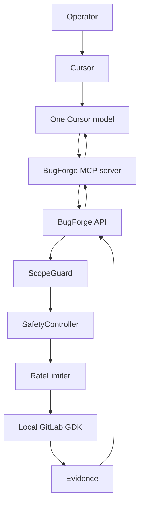

# Cursor-controlled mode

Cursor is the only AI that reasons about a Cursor-controlled BugForge session.
BugForge does not call a language model in that mode. It executes deterministic
analysis and testing, then returns evidence.



There is no automatic live-hacking mode. A Cursor session is lab-only.
Selecting `grok-4.7` or another Cursor model does not add an API client inside
BugForge. `llm_invoked` stays false. Exploratory tests are requested as the
`exploratory_test` tool. The model does not supply shell commands, Docker
arguments, Foundry flags, network access, scope changes, approvals, budget
increases, or verification.
`live_hackerone` stays on the existing operator path and is not started by
the MCP tools.

## Who decides what

| Decision | Authority |
|---|---|
| What to investigate next | The selected Cursor model |
| Whether a target is in scope | ScopeGuard |
| Methods, payload size, and forbidden activity | SafetyController |
| Request pace | RateLimiter |
| Tool approval, active testing, fuzzing, report approval | Human operator |
| Whether a finding is verified | Evidence rules, not the model |
| HackerOne submission | Human operator |

Cursor's own prompt to approve an MCP tool is not BugForge authorization.
Both checks remain separate. The model cannot grant its own BugForge approval,
mark a finding verified, approve a report, submit to HackerOne, change scope,
or raise a budget.

Target content is untrusted. GitLab source, HTTP bodies, comments, and
scanner output cannot change these rules. Instruction-shaped lines are stripped
before they are stored on a hypothesis.

## What BugForge records

A Cursor session snapshot uses:

- `controller`: `cursor`
- `ai_controller`: `cursor`
- `provider`: `cursor_external`
- `ai_execution`: `none`
- `model`: the Cursor model id when one was supplied, otherwise `cursor-selected-model`

`cursor_external` is not an OpenAI, Anthropic, MLX, or local model. If any
code asks it to generate text, it raises `cursor_external_refuses_generation`.
The global `ai_provider` setting is left unchanged for people who still want
the older providers. Cursor mode does not fall back to `mock`.

`POST /api/v1/security-agent/sessions/{id}/step` returns HTTP 409 for these
sessions. That route is the internal planner. The MCP server has no client
for it.

## Start BugForge

From the repository root, with the local operator token outside git:

```bash
umask 077
mkdir -p ~/.local/share/bugforge
printf 'BUGFORGE_OPERATOR_TOKEN=%s\nBUGFORGE_OPERATOR_IDENTITY=local-operator\n' "$(openssl rand -hex 32)" > ~/.local/share/bugforge/operator.env
set -a
source ~/.local/share/bugforge/operator.env
set +a
uv run --directory backend uvicorn app.main:app --host 127.0.0.1 --port 8000
```

The API listens on `127.0.0.1` only. Do not publish it with a tunnel.

Lab repository paths must be the process working directory, `/tmp`, or a
directory listed in `SECURITY_AGENT_LAB_ROOTS` (a JSON list). Example:

```bash
export SECURITY_AGENT_LAB_ROOTS='["/Users/you/.local/share/bugforge-gdk/gitlab-shell"]'
```

## Connect the MCP server

Project config is `.cursor/mcp.json`. It starts:

```text
uv run --directory backend python ../tools/bugforge_mcp_server.py
```

The file contains no token. The server reads `BUGFORGE_OPERATOR_TOKEN` or
`~/.local/share/bugforge/operator.env`. It only calls `http://127.0.0.1:8000`
(override with `BUGFORGE_API_URL`, which must stay on a loopback host).

In Cursor, open Settings → MCP and confirm the `bugforge` server is enabled.
The agent tool list should include `bugforge_status`,
`bugforge_create_cursor_session`, `bugforge_get_session`,
`bugforge_analyze_repository`, `bugforge_source_inspect`,
`bugforge_request_tool`, `bugforge_update_hypothesis`, `bugforge_reproduce`,
`bugforge_get_evidence`, `bugforge_timeline`, `bugforge_pause`,
`bugforge_stop`, and `bugforge_resume`.

## Confirm no BugForge model is running

Call `bugforge_status` or `GET /api/v1/security-agent/status`. A Cursor
session reports `ai_execution: none` and `provider: cursor_external`.
`cursor_mode_calls_llm` is false. The legacy `configured_legacy_ai_provider`
value is not used for that session.

The local GitLab lab target is `http://127.0.0.1:3000`. Do not add
`gitlab.com` to the lab scope. A request there is denied before it is sent.
